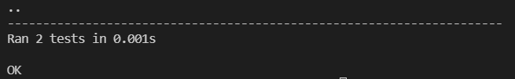
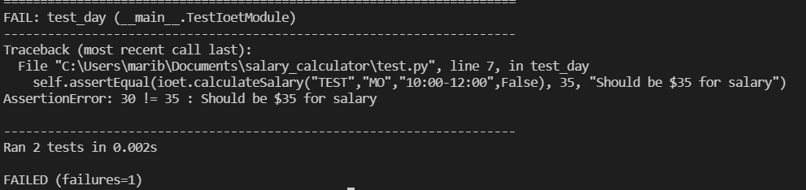
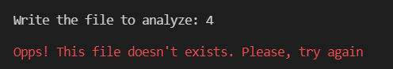
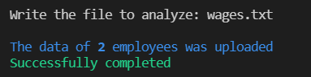
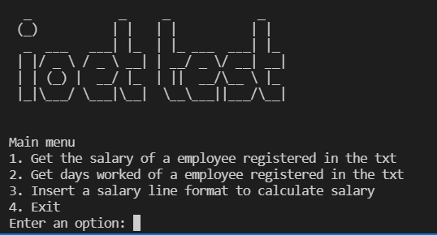
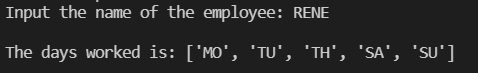
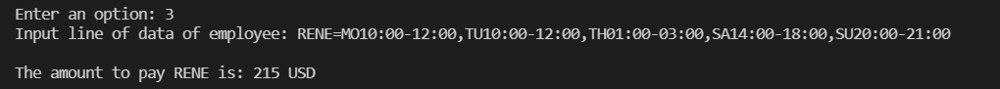

# Salary Calculator

## Table of contents
* [General info](#general-info)
* [Test](#test)
* [Run](#run)

## General info
This repository is to calculate the total that the company has to pay an employee, based on the hours they worked and the times during which they worked.

## Technologies
Project is runnable with:
* Python 2.5 >=
* Unittest
	
## Test
To run test for this project, I made a script called test.py, 

```
$ py test.py
```

### Test executed correctly:


### Fail test:



## Run
Run this command:

```
$ py salary_calculatory.py
```

Then, write file to analyze

If the file does not exist or there is an exception, a similar message will be presented:



In case it is correct,




### Main Menu



### Option 1

Get the wages of a registered employee

Example:


### Option 2
Get the days worked by a registered employee

Example:


### Option 3
Manually enter a salary line and calculate the result

Example:


### Option 4
Goodbye (:

Example:
